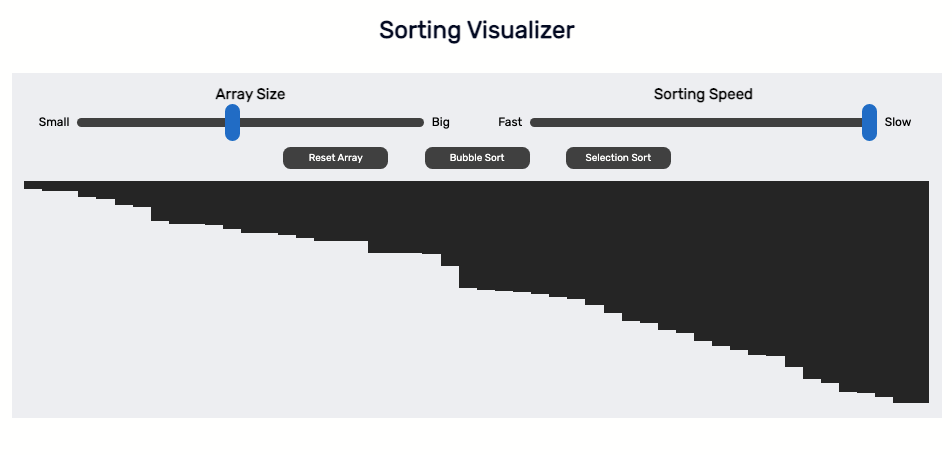

# Sorting-Visualier
A simple Sorting Visualizer Web App.

Check out the Sorting Algorithm Visualizer [here](https://RalphAlexander.github.io/Sorting-Visualizer/).
# Features: 
- **Sort Algorithms with an Animation:** Visualize how Bubble Sort and Selection Sort works
- **Reset Array:** Reset and randomize the height of the bar using this feature
- **Sorting Algorithm Descriptions:** Hover over the button for each respective sorting algorithms and its description will appear
- **Adjustable Array Size and Sorting Speed:** Increase or decrease to see how the sorting algorithm looks like with different configurations
